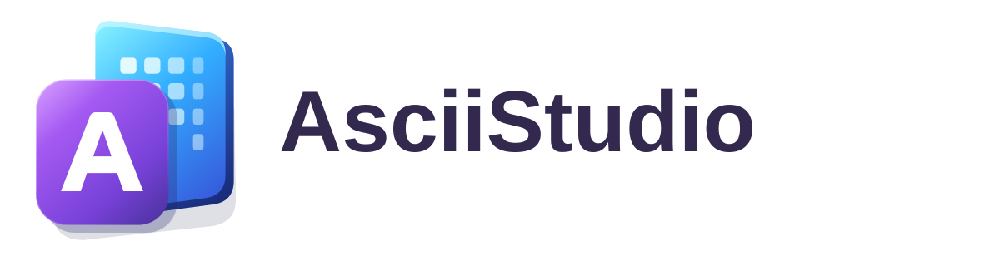
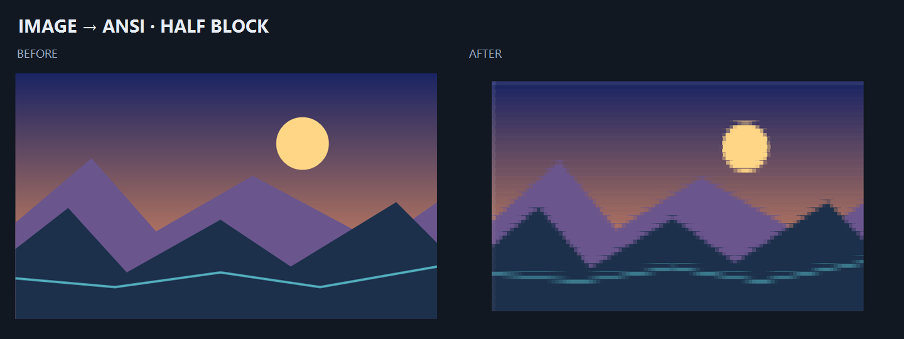
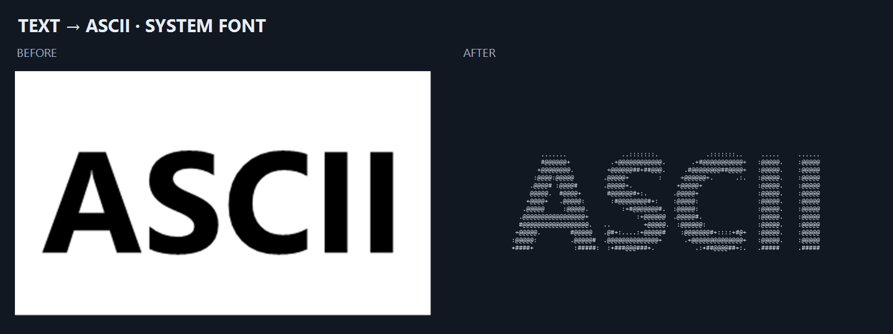
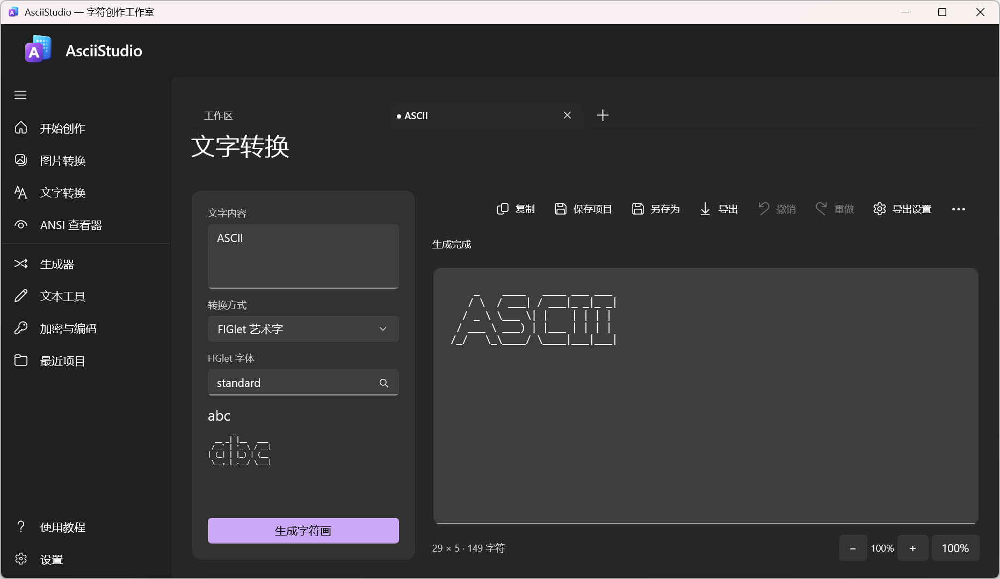
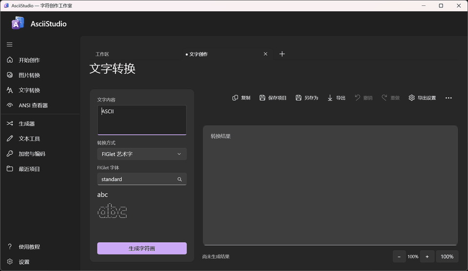

# AsciiStudio

<p align="center">
  
</p>

**Windows 原生、离线、高质量 ASCII / ANSI 创作工具。**

图片或文字 → 调整转换质量 → 编辑与比较 → 保存项目 → 导出作品。转换与导出在本机完成。

### [⬇ Download · 下载预发布版](https://github.com/msmapwr/ascii-studio/releases)　[Release · 更新说明](https://github.com/msmapwr/ascii-studio/releases)　[0.9 路线图](docs/ROADMAP.md)

Windows x64：下载 Release 中的 ZIP，完整解压后运行 `AsciiStudio.exe`。使用便携版无需开发 SDK。
当前为 0.9 预发布阶段；未经用户明确许可，不发布正式版 1.0.0。




以上为应用同一转换／导出代码生成的样例，原图由仓库工具绘制；可[离线复现](assets/showcase/README.md)。

<p>
  
  
</p>

实机窗口截图与操作截图序列，无界面模拟。

## 功能

- 图片转字符画：打开或粘贴图片，调整字符集、尺寸、比例、亮度、对比度、颜色和抖动方式。支持 PNG、JPEG、BMP、GIF 第一帧和 TIFF。
- 图片质量：字体密度实测、结构线条、Braille、半块双色、自适应、透明裁剪和调色板；阶段缓存、临时预览及可取消转换。详见 [图片质量说明](docs/IMAGE_QUALITY.md)。
- 文字转字符画：FIGlet／系统字形，字行距、换行、对齐、规则重叠、字体网格／收藏／导入、中文描边与缺字提示、混排预设、标题边框。详见 [文字排版说明](docs/TEXT_LAYOUT.md)。
- ANSI 查看器：查看 ANSI 文件或粘贴转义序列，读取常见颜色、编码和 SAUCE 信息。
- 编辑与整理：编辑字符画、调整预览缩放、撤销和重做。手工修改后可选择更新结果或保留独立版本。
- 大结果与对比：可见区域预览、适应窗口/宽度、分页编辑与选区定位，支持原图切换、并排和可拖动分界线。使用方法及资源边界见 [视图说明](docs/VIEWPORT.md)。
- 项目与导出：保存 `.asciiproj` 项目并恢复创作来源。可导出 TXT、PNG、JPEG、静态 GIF、HTML、SVG、ANSI、JSON 和 Markdown。

结果历史最多保存 100 步，并受 64 MB 预算限制。0.9 聚焦转换、ANSI、编辑、保存和导出；动画、摄像头、3D 已冻结，见[路线图](docs/ROADMAP.md)。

已有辅助工具继续可用：生成边框与图案、整理文本、代码注释、本地加密与编码。它们不扩大本阶段的开发范围。

## 获取与运行

### 环境要求

- Windows x64，最低目标为 Windows 10 1809
- .NET SDK `10.0.401`（由 `global.json` 固定）
- Visual Studio 2026、WinUI 工作负载和 Windows SDK 26100
- Windows App SDK `2.5.1`
- WinApp CLI `0.7.0` 和项目要求的 `microsoft/win-dev-skills`

克隆仓库后，在项目目录启动：

```powershell
.\BuildAndRun.ps1 .\src\AsciiStudio\AsciiStudio.csproj --detach
```

也可以打开 `AsciiStudio.slnx`，将 `AsciiStudio` 设为启动项目。生成 Release 构建：

```powershell
.\scripts\build.ps1 -Configuration Release
```

开发环境和 CI 发布流程见 [CI 与 Release](docs/CI_RELEASE.md)。

## 文件与限制

设置、最近项目、窗口位置、结果恢复和日志位于 `%LOCALAPPDATA%\AsciiStudio`。恢复数据保存在本机；最近项目列表记录的是文件路径。

图片文件上限为 40 MB，源图上限为 8000 万像素，处理时最长边缩至 2400 像素。图片结果最多 2000 列、2000 行和 400 万采样点；Braille每字符8点，半块每字符2点。位图导出上限为 4000 万像素，单边不超过 32767 像素。较大的作品可改用文本格式导出。

GIF 目前只读取第一帧，导出的 GIF 也是静态图。字符画网格按Unicode字符簇和显示列计算，中文与emoji使用双列；字体或终端的实际字形可能不同，详见[Unicode说明](docs/UNICODE.md)。FIGlet 模式接受 ASCII 输入；中文文字请使用系统字体模式。

## 相关文档

- [0.9 路线图](docs/ROADMAP.md)
- [架构与测试](docs/ARCHITECTURE.md)
- [历史归档](docs/archive/README.md)
- [第三方依赖说明](docs/THIRD_PARTY.md)
