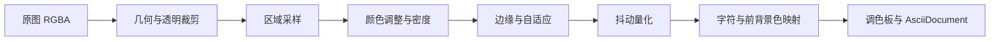

# 创作架构

## 职责边界

`AsciiStudio.Application` 提供 Windows 原生但不依赖 WinUI 的共享服务，包含字体栅格化、转换 Controller、项目读写、偏好和位图导出。桌面项目仅保留 MotionService、WindowPlacementService 和页面会话接口等 UI 服务；`AsciiStudio.Cli` 引用同一应用服务层，负责参数解析、输入输出与显式覆盖策略。算法继续位于 Core。共享服务不访问页面控件，CLI 不加载 WindowsAppSDK。

CLI 的 `ProjectEditSession` 管理项目旁侧文件与有界历史，`TextEditOperations` 统一 Unicode 选区边界，`CliWorkspace` 管理独立的路径清单与恢复列表；命令分发位于 `CliEditCommands`，避免继续扩充单一主调度文件。源项目保留转换来源，侧文件只保存作品修订与生成基准；SHA-256 检查外部修改，文件锁串行化 CLI 写入。检测到来源失效时，只允许显式恢复到独立快照或丢弃侧文件，不绑定到新来源。单文件原子替换，多文件提交不保证事务。

| 层 | 责任 | 不应承担 |
|---|---|---|
| ImagePage / TextPage | 控件、读取当前输入、呈现状态、文件选择器和对话框 | CPU 转换、缓存、生成项目状态 |
| ImageCreationController | 串行转换、低成本预览、原图尺寸策略、项目快照 | WinUI 控件与位图对象 |
| ImageSourceState | 输入数据、原图预览、来源及加载版本 | 页面控件 |
| TextCreationController | 生成、缺字检查、字体样本、已生成来源快照 | 控件读写 |
| TextProjectMapper | 文字项目快照、旧布局参数兼容 | 导航与对话框 |
| ProjectFileService / BoundedFile | 打开句柄后检查资源上限、统一项目与恢复校验 | 页面赋值、自动丢弃损坏数据 |
| AnsiProjectMapper | ANSI 来源字节和恢复参数校验 | 解析任务调度和控件读写 |
| LatestOperation | 取消前次操作、判断最新结果提交权、独立生命周期 | 线程池同步；由 UI 线程持有 |
| ImagePipelineService | 解码／几何／采样／过滤／结果缓存与预算 | 结果编辑或保存策略 |
| AsciiStudio.Core | 算法、文档网格、ANSI、历史、导出文本格式 | Windows UI |
| ResultPane / WorkspaceService | 编辑保护、结果视图、保存、恢复会话 | 图片和文字转换算法 |

页面继续采用项目已有代码式 WinUI 构建。先提取 Controller，后续逐步提取参数模型和恢复映射；
此次不做一次性 MVVM 全面迁移。页面仍负责控件参数读取、字体库呈现、文件选择器和恢复后的控件赋值。

## 图片阶段



- 高质量路径的 Sample、AdjustColors、ApplyEdges、Dither、Map 是独立阶段；Filter 保留兼容入口。
- 过滤和抖动使用私有密度缓冲，不修改缓存输入。颜色数组作为只读共享输入处理。
- 旧密度路径保留 double 精度及原取整规则，每格串接采样和颜色调整，避免额外的大型 RGB 缓冲。
- Controller 串行进入图片管线；取消与 latest-operation 检查阻止过期操作覆盖新结果。
- 手工编辑保护仍统一由 ResultPane 负责；预览不更改导出尺寸和项目内容。

## 测试

```powershell
dotnet test tests/AsciiStudio.Core.Tests/AsciiStudio.Core.Tests.csproj -c Release --logger trx
dotnet test tests/AsciiStudio.Creation.Tests/AsciiStudio.Creation.Tests.csproj -c Release --logger trx
```

核心原有 75 个检查迁为 59 个 Fact 和 16 个 Theory 数据项，分成 11 个领域文件；原断言保留。
另外覆盖调度生命周期、阶段输入不变性及与 alpha.7 算法逐字符／颜色比较。
LegacyImageConverter / LegacyImageQualityConverter 是固定在 Git `4e2b953` 的测试参考实现，
只用于回归比较，不参与应用编译。算法行为有意改变时须明确记录兼容性并评审参考基线。

原有 10 项 Windows 字体控制台检查已完整迁入 Creation.Tests 的 NativeFontTests，保留原断言。
字体导入、收藏和原名兼容检查使用隔离工作目录与串行 xUnit Collection。
Creation.Tests 同时验证 Controller 的原图准备、取消、预览尺寸、项目映射、恢复、迁移备份和快照隔离。
PowerShell 保留为 UI / 端到端编排，核心质量不再依赖自定义测试计数器。
GitHub Actions 上传 TRX；UI 验收需要真实桌面，CI 编译不能替代 DPI 和辅助功能实测。
