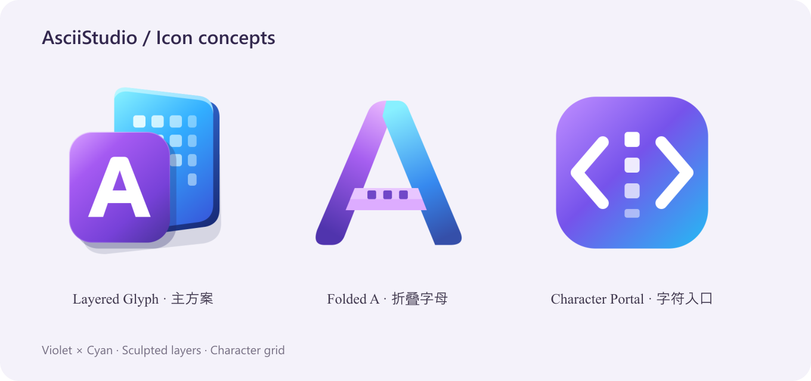

# Charloom 视觉标识

## 主方案：Layered Glyph

紫色字母 A 表示 ASCII 与创作；蓝色后层的字符网格表示图片被采样成字符单元。错位层叠、柔和圆角、渐变和边缘高光强调创作软件的立体质感。

参考 [Microsoft 365 2025 新图标介绍](https://techcommunity.microsoft.com/blog/microsoft365insiderblog/new-microsoft-365-icons-for-the-ai-era/4458674) 的简洁轮廓、鲜明色彩与统一设计语言。图形为独立绘制，未使用微软原始图标资产。



## 交付

- `assets/branding/charloom-primary.svg`：主标识，透明背景，512 单位画布。
- `charloom-ribbon.svg`：折叠字母 A，适用于更简洁的符号方向。
- `charloom-grid.svg`：字符入口，强调编辑与程序工具。
- `charloom-horizontal.svg` / `charloom-vertical.svg`：组合字标，使用 Segoe UI 字体回退；交付印刷前需转轮廓。
- `charloom-monochrome.svg`：单色几何 A，使用 currentColor。
- 三个 512px PNG 和概念板。
- `src/Charloom/Assets`：32–1024px PNG、多尺寸 ICO，以及 MSIX scale-100/200/400 资源。

## 规范

主色为紫色 `#7741D8`，辅助色为蓝色 `#32AEFF` 与青色 `#85F0FF`。保留原始渐变和比例。符号周围至少保留符号宽度 12.5% 的空间。界面建议至少 32px；16–24px 使用 ICO，并允许小尺寸下网格细节简化。

彩图适用于浅色和深色背景。单色版需使用与背景有足够对比的前景色。不要拉伸、旋转或更改内部字母比例。

## 重建资产

使用 Node.js 与 sharp：

```powershell
node scripts/generate-brand-assets.cjs
```

此脚本只从 SVG 生成派生资产，没有外部网络请求。应用的 header、EXE/窗口/任务栏、MSIX 磁贴共享主方案。
